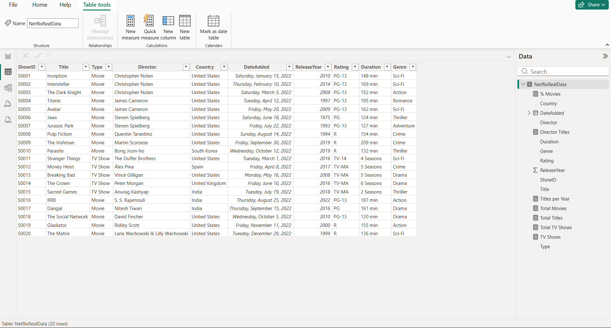

# 📊 Netflix Dashboard - Power BI
An interactive Power BI dashboard built to analyze Netflix's content library. This project provides insights into movies and TV shows through interactive visualizations and filters.

## 📌 Project Overview
The dashboard helps users explore Netflix's catalog by analyzing:
- 🎬 Movies vs TV Shows
- 🌍 Content by Country
- 🎭 Genre Distribution
- ⭐ Ratings Distribution
- 📅 Release Year Trends
- 🎥 Director Analysis
- 📈 Content Performance

## 🛠️ Tools & Technologies
- Microsoft Power BI
- Power Query
- DAX
- Microsoft Excel
- ## 📂 Project Structure
```text
Netflix-PowerBI-Dashboard
│
├── Dataset/
│   └── NetflixDataset.xlsx
│
├── Images/
│   ├── PowerBI Full Dashboard (1).png
│   ├── PowerBI Full Dashboard (2).png
│   ├── Director & Genre Analysis Dashboard.png
│   ├── Content Performances Dashboard.png
│   └── NetflixRealData.png
│
└── Netflix Project.pbix
```
# 📸 Dashboard Preview
## Main Dashboard
.png)

## Director & Genre Analysis


## Content Performance


## Dataset Preview


## ✨ Key Insights
- Netflix contains more Movies than TV Shows.
- Drama and International content dominate the platform.
- Content production increased significantly after 2015.
- The United States contributes the highest number of titles.
- Interactive filters allow detailed exploration of the data.

## 🚀 Skills Demonstrated
- Data Cleaning
- Data Modeling
- DAX Calculations
- Data Visualization
- Dashboard Design
- Business Intelligence

## 👨‍💻 Author
**Karthikeyan**

📧 Email: karthisampath11@gmail.com

🔗 LinkedIn: https://www.linkedin.com/in/karthi-keyan-ai

💻 GitHub: https://github.com/karthisampath11-ux

---

⭐ If you like this project, consider giving it a star!
